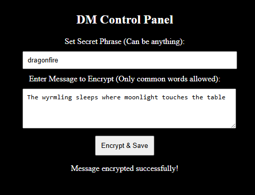

# 🔮 D&D Magical Cipher Scroll  
### *A custom cryptographic puzzle system for Dungeon Masters*

Welcome, Traveler!  
The **Magical Cipher Scroll** is an interactive, web-based puzzle tool that allows Dungeon Masters to create fully encrypted in-game messages using a **custom word-replacement cipher** built specifically for Dungeons & Dragons campaigns.

Players must enter the correct *secret passphrase* to reveal the true message…  
but beware — entering the **wrong phrase** will still decode the scroll using an *algorithmically chosen sequence of valid English words*, giving the illusion of meaning while hiding the truth.

Perfect for immersive puzzles, mystery arcs, ancient prophecies, or cryptic tomes discovered deep within forgotten ruins.

---

## ✨ Features

### 🔐 **Custom Full-Word Substitution Cipher**
This application does **not** use character-level shifting or simple ROT encoding.  
Instead, it encrypts entire words using:

- A **dictionary of common English words**, curated around fantasy/adventuring vocabulary  
- A **one-way deterministic mapping**, generated using the secret passphrase  
- A reversible decode process only when the *correct phrase* is entered  

The result is a cipher that feels *ancient, magical, and thematic*, yet is powered by robust modern cryptographic techniques.

### 🧙 **Dungeon Master Control Panel**
DMs can:

- Enter the *secret passphrase*  
- Write a message to encrypt  
- Receive instant real-time validation (invalid, non-dictionary words are flagged)  
- Save the encrypted message to the backend  
- Update or overwrite the stored scroll anytime  

Only the DM has the ability to encode messages — players can *never* see the plaintext unless they guess the password.

### 📜 **Player Cipher Scroll**
Players see:

- A beautifully animated parchment scroll
- A single input field where they type the suspected passphrase
- Smooth transition from “locked” to “decoding”
- Words materialize one by one using cinematic magical animation
- **Correct passphrase → fully decoded secret message**
- **Incorrect passphrase → believable but wrong sentence**

This ensures that players cannot brute-force the system by assuming “wrong = gibberish.”  
Instead, every incorrect guess generates a *plausible output* using your curated dictionary — immersive and deceptive.

---

## 🧠 How the Cipher Works (High-Level Overview)

1. **DM enters a passphrase**  
   - The passphrase seeds a deterministic mapping  
   - Every word in the dictionary gets assigned a unique encoded form  

2. **DM writes the true message**  
   - Words are validated to ensure they exist in the allowed dictionary  
   - The message is transformed using the custom mapping  
   - Encrypted message is stored in the database  

3. **Player enters a passphrase to attempt decoding**  
   - If passphrase is correct → mapping perfectly reconstructs the original message  
   - If incorrect → mapping still resolves to valid dictionary words,  
     producing a *valid but completely incorrect* sentence  
     (this protects the illusion, making the cipher feel authentically arcane)

---

## 🛠 Tech Stack

### **Frontend**
- React + Vite  
- Motion (for smooth word-by-word decoding animation)  
- Custom parchment UI (scroll effects, magical reveal animations)  

### **Backend**
- Node.js / Express  
- Custom cryptographic dictionary-based encoder/decoder  
- Real-time word validation  
- Full message encryption/decryption pipeline

---

## 🚀 Live Demo
> https://dndpuzzleapp-g577.onrender.com/

---

## 📂 Project Structure (High-Level)

- `/backend`  
  - Express server, encryption logic, dictionary tools  
- `/frontend`  
  - React interface for DM and Player views  
  - Animated decoding system  

---

## 🎮 Ideal Uses in D&D Campaigns

- Ancient prophecy fragments    
- Secret messages
- Notes left by mysterious NPCs  
- Clues hidden in spellbooks  
- Puzzle rooms with multi-step deciphering mechanics  
- Player-driven investigation arcs

This app is battle-tested in a long-running D&D campaign and has proven to be one of the most engaging and interactive mystery/puzzle tools at the table.

---

## 🧪 Example Puzzle Flow

1. DM encodes:
   > “The wyrmling sleeps where moonlight touches the table.”

   

2. Players see the encrypted scroll.  
   They try guessing:

   - `"moon"` → *Incorrect output*  
   - `"wyrmsong"` → *Incorrect output*  
   - `"dragonfire"` → *Correct — true message revealed*  

   Incorrect Passphrase Example:
   

   Correct Passphrase Example:
   

Each wrong passphrase creates a convincing alternate message, making the puzzle feel alive and magical.

---

## 💬 Want to Use This in Your Own Campaign?

### NOTE: This repo is for demo purposes, and as such the DM Panel has *NOT* been password protected. 

Clone the repo, customize the dictionary, adjust the UI, or integrate it with other DM tools — it’s designed to be modular, lightweight, and easily themeable.

If you'd like help adapting it to your worldbuilding or adding new cipher modes (runic, celestial, infernal, numerological, etc.) just open an issue or reach out!

---

## 🧙‍♂️ Final Thoughts

The **Magical Cipher Scroll** is more than a mini-game — it's a storytelling engine.  
It transforms simple secrets into **interactive narrative moments**, encouraging teamwork, creativity, and mystery.

May your riddles confound your players,  
and may your secrets remain hidden until the right words are spoken.

🪄📜✨

