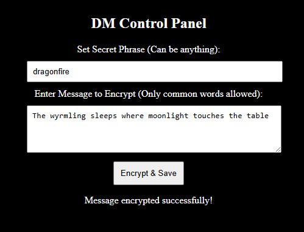

# 🔮 D&D Magical Cipher Scroll  
### *A custom cryptographic puzzle system for Dungeon Masters*

Welcome, Traveler!  
The **Magical Cipher Scroll** is an interactive, web-based puzzle tool that allows Dungeon Masters to create fully encrypted in-game messages using a **custom word-replacement cipher** built specifically for Dungeons & Dragons campaigns.

Players must enter the correct *secret passphrase* to reveal the true message…  
but beware — entering the **wrong phrase** will still decode the scroll using an *algorithmically chosen sequence of valid English words*, giving the illusion of meaning while hiding the truth.

Perfect for immersive puzzles, mystery arcs, ancient prophecies, or cryptic tomes discovered deep within forgotten ruins.

---

## 🚀 Live Demo
> https://dndpuzzleapp-g577.onrender.com/
>
> Note: Hosted on Render’s free tier. The first request after inactivity may take ~30–60 seconds while the backend spins up.

---

## ✨ Features

### 🔐 **Custom Full-Word Substitution Cipher**
This application does **not** use character-level shifting or simple ROT encoding.  
Instead, it encrypts entire words using:

- A **dictionary of common English words**, curated around fantasy/adventuring vocabulary  
- A **one-way deterministic mapping**, generated using the secret passphrase  
- A reversible decode process only when the *correct phrase* is entered  

The result is a cipher that feels *ancient, magical, and thematic*, yet is powered by robust modern cryptographic techniques.

### 🧙 **Dungeon Master Control Panel**
DMs can:

- Enter the *secret passphrase*  
- Write a message to encrypt  
- Receive instant real-time validation (invalid, non-dictionary words are flagged)  
- Save the encrypted message to the backend  
- Update or overwrite the stored scroll anytime  

Only the DM has the ability to encode messages — players can *never* see the plaintext unless they guess the password.

### 📜 **Player Cipher Scroll**
Players see:

- A beautifully animated parchment scroll
- A single input field where they type the suspected passphrase
- Smooth transition from “locked” to “decoding”
- Words materialize one by one using cinematic magical animation
- **Correct passphrase → fully decoded secret message**
- **Incorrect passphrase → believable but wrong sentence**

This ensures that players cannot brute-force the system by assuming “wrong = gibberish.”  
Instead, every incorrect guess generates a *plausible output* using your curated dictionary — immersive and deceptive.

For a given saved puzzle and dictionary, incorrect guesses are deterministic:
repeating the same phrase returns the same words, even after a backend restart.
Letter case is ignored. Wrong guesses use a SHA-256-derived substitution based on
the lowercase guess, saved puzzle (ciphertext and word mapping), and each encoded
word, so repeated encoded words also repeat in the output. Changing the puzzle or
dictionary can change these results. Outputs use dictionary words; grammatical
sentences are not guaranteed.

When saving a message, leading/trailing whitespace is removed and spaces, tabs,
and newlines between words become single spaces. Encryption uses unique
dictionary entries so distinct words do not collide because of duplicate entries.

---

## 🧠 How the Cipher Works (High-Level Overview)

1. **DM enters a passphrase**  
   - The passphrase seeds a deterministic mapping  
   - Every word in the dictionary gets assigned a unique encoded form  

2. **DM writes the true message**  
   - Words are validated to ensure they exist in the allowed dictionary  
   - The message is transformed using the custom mapping  
   - Encrypted message is stored in the database  

3. **Player enters a passphrase to attempt decoding**  
   - If passphrase is correct → mapping perfectly reconstructs the original message  
   - If incorrect → mapping still resolves to valid dictionary words,  
     producing a *valid but completely incorrect* sentence  
     (this protects the illusion, making the cipher feel authentically arcane)

---

## 🛠 Tech Stack

### **Frontend**
- React + Vite  
- Motion (for smooth word-by-word decoding animation)  
- Custom parchment UI (scroll effects, magical reveal animations)  

### **Backend**
- Node.js / Express  
- Custom cryptographic dictionary-based encoder/decoder  
- Real-time word validation  
- Full message encryption/decryption pipeline

---

## 📂 Project Structure (High-Level)

- `/backend`  
  - Express server, encryption logic, dictionary tools  
- `/frontend`  
  - React interface for DM and Player views  
  - Animated decoding system  

---

## 🎮 Ideal Uses in D&D Campaigns

- Ancient prophecy fragments    
- Secret messages
- Notes left by mysterious NPCs  
- Clues hidden in spellbooks  
- Puzzle rooms with multi-step deciphering mechanics  
- Player-driven investigation arcs

This app is battle-tested in a long-running D&D campaign and has proven to be one of the most engaging and interactive mystery/puzzle tools at the table.

---

## 🧪 Example Puzzle Flow

1. DM encodes:
   > “The wyrmling sleeps where moonlight touches the table.”

   

2. Players see the encrypted scroll.  
   They try guessing:

   - `"moon"` → *Incorrect output*  
   - `"wyrmsong"` → *Incorrect output*  
   - `"dragonfire"` → *Correct — true message revealed*  

   Incorrect Passphrase Example:
   

   Correct Passphrase Example:
   

Each wrong passphrase creates a convincing alternate message, making the puzzle feel alive and magical.

---

## 💬 Want to Use This in Your Own Campaign?

### DM panel access

The player page hides the DM link by default. Visit `/dm` directly to unlock the
panel with a separate DM password. The backend also requires an authenticated
session for message validation and saving, so direct API requests cannot bypass
the panel lock.

1. Copy `backend/.env.example` to `backend/.env` and set `DM_PASSWORD` to a private
   password. On a hosted backend such as Render, set `DM_PASSWORD` in the service's
   environment settings instead. Restart the backend after changing it.
2. Start the backend from its directory with `node server.js` and start the
   frontend from its directory with `npm run dev`.
3. Open `/dm`, enter the DM password, and create the puzzle as usual. The DM
   password is separate from the arcane phrase players use to decode the scroll.
   Arcane phrases must be entered in lowercase by the DM. Player guesses ignore
   letter case: `moon song`, `Moon Song`, and `MOON SONG` decode the same puzzle.
   Spaces, numbers, and punctuation are allowed in the phrase. The DM login
   password remains case sensitive.
4. Use **Lock panel** before giving players access to your browser. Refreshing or
   leaving the DM page also clears its local access and unsaved fields. Sessions
   expire after eight hours and are invalidated when the backend restarts.

Without `DM_PASSWORD`, DM login and write access are disabled. Keep this password
on the backend; never put it in a `VITE_` environment variable or frontend code.
Use HTTPS when hosting the app. Failed login attempts are limited to ten per
15-minute window per IP as seen by Express (a reverse proxy may share this limit
across visitors).

If you want a visible DM navigation link, set `VITE_SHOW_DM_LINK=true` in the
frontend environment and restart Vite or rebuild the frontend. The password is
still required whether the link is visible or hidden.

### Persistent puzzle storage on Render

1. Create a Render Postgres database in the same region as the backend service.
2. Copy its **Internal Database URL** into a backend environment variable named
   `DATABASE_URL`. Keep the value private and out of GitHub and the frontend.
3. Save and deploy the backend. It creates the `arcane_puzzle` table automatically
   on the first puzzle read or save; no manual SQL setup is needed.
4. Open `/dm` and save your puzzle. The database stores the arcane phrase,
   encrypted message, and word mapping together. A new save replaces the current
   puzzle. Backend restarts and deployments preserve it.

The backend reads the current puzzle from the database for each player request.
Database failures return a temporary-unavailable error; a failed save is never
reported as successful. DM login sessions still expire on backend restarts.

Local development without `DATABASE_URL` uses temporary in-memory storage.
On Render, `DATABASE_URL` is required for puzzle access so the app cannot silently
fall back to storage that disappears when the service sleeps.

Render's free Postgres database expires after 30 days. If you replace it, update
`DATABASE_URL`, redeploy, and re-enter the puzzle; the new table is created
automatically. Existing database contents are not copied to the replacement.
The backend's cold-start delay still applies independently of puzzle storage.

Clone the repo, customize the dictionary, adjust the UI, or integrate it with other DM tools — it’s designed to be modular, lightweight, and easily themeable.

If you'd like help adapting it to your worldbuilding or adding new cipher modes (runic, celestial, infernal, numerological, etc.) just open an issue or reach out!

---

## 🧙‍♂️ Final Thoughts

The **Magical Cipher Scroll** is more than a mini-game — it's a storytelling engine.  
It transforms simple secrets into **interactive narrative moments**, encouraging teamwork, creativity, and mystery.

May your riddles confound your players,  
and may your secrets remain hidden until the right words are spoken.

🪄📜✨

